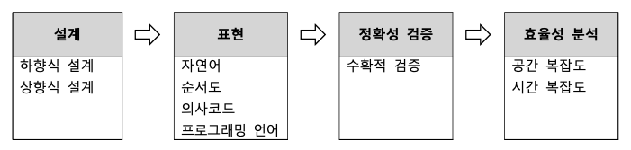

# 알고리즘 (Algorithm)

* 어떤 문제를 해결하기 위한 **일련의 절차**를 **공식화한 형태**로 표현한 것
* 주어진 문제를 컴퓨터를 이용하여 해결해야 한다.

## 알고리즘의 조건

* 입력: 0개 이상의 외부 입력
* 출력: 1개 이상의 출력
* 명확성: 각 명령은 모호하지 않고 명확해야 한다.
* 유한성: 일정한 시간 내에 반드시 종료되어야 한다.
* 유효성: 모든 명령은 컴퓨터에서 수행 가능해야 한다. (모든 과정은 명백하게 실행 가능한 것이어야 한다.)

## 알고리즘의 생성 단계

<figure><figcaption></figcaption></figure>

1. 설계: 상향식, 하향식 설계
2. 표현: 알고리즘을 표현하는 방법 (자연어, 순서도, 의사코드, 프로그래밍 언어)
3. 정확성: 알고리즘이 타당한 입력이 주어졌을 때 유한 시간 대에 계산이 수행되어 올바른 결과를 출력하는 것
4. 효율성: 저장 공간과 연산 수행의 효율성

## 알고리즘의 다양한 표현

### 1 자연어

* 인간의 언어 (가장 표현하기 쉬움)

### 2 순서도

* 약속된 기호를 사용, 그림으로 표현
* 표준 기호로 박스와 연결선으로 표현한 도표
* 프로그래밍 과정에서 프로그램의 설계도의 역할을 담당
* 명확하고 논리적인 프로그램을 작성할 수 있다. (이해와 추적이 쉬워 에러 검색이 쉬움)
* 국제 표준이 있음

| 심벌 형태                                                              | 이름    | 의미                                               |
| ------------------------------------------------------------------ | ----- | ------------------------------------------------ |
|  | 시작/끝  | 순서도의 시작과 끝                                       |
|  | 처리    | 지정된 동작, 연산, 값, 데이터의 이동 등 모든 처리과정을 나타낸다.          |
|  | 판단    | 주어진 조건을 비교한 후 해당되는 조건에 다라 왼쪽 또는 오른쪽으로 흐름이 나뉘어진다. |
|  | 입력/출력 | 일반적인 입력과 출력을 나타낸다.                               |
|  | 연결자   | 흐름이 다른 곳으로 연결되거나 다른 곳으로부터 연결되는 입구를 나타낸다.         |
|  | 프린트   | 프린터를 통해 출력한다.                                    |
|  | 흐름선   | 명령의 흐름을 나타내며, 화살표 방향의 순서대로 진행됨을 나타낸다.            |

[Flowgorithm](http://www.flowgorithm.org): 순서도 제작 응용 프로그램[Oven](https://ovenapp.io): 프로토타입 제작 응용 프로그램

### 3 의사코드

* 수도코드(Pseudo Code) 라고도 한다.
* 알고리즘이나 자료구조를 표현할 때 사용한다.
* 사고의 흐름을 간결하고 효과적으로 전달할 수 있다.
* 코드를 흉내 내어 알고리즘을 표현한다.

### 4 프로그래밍 언어 (C)

* C, C++, Python 등 다양한 언어로 알고리즘을 표현
* 컴퓨터가 수행할 수 있는 명령어들의 집합
* 각 언어마다 문법적 특징와 사용법이 달라 학습이 필요하다.

## 유용한 알고리즘 4가지

| 종류     | 설명                                                                                                                                                                                     |
| ------ | -------------------------------------------------------------------------------------------------------------------------------------------------------------------------------------- |
| 정렬     | 
- 원소들을 일정한 순서로 열거하는 알고리즘 - 순서를 정렬하는 것 또는 분류하는 것으로 나뉜다. - 다른 알고리즘을 최적화 하는데 사용된다. - 데이터 정규화 또는 의미 있는 결과물을 생성하는데 유용하게 사용된다. - 버블 / 선택 / 삽입 / 쉘 / 힙 / 기수 / 외부 정렬 들이 있다.
 |
| 탐색     | 
- 데이터를 효율적으로 찾기 위한 알고리즘 - 순차 / 이진 / 레드 블랙 트리 알고리즘이 있다.
                                                                                                                       |
| 그래프    | 
- 간선과 결합을 이용 - 정점에 대한 표현은 다양한 자료구조를 사용할 수 있다. - 간선에 대한 표현을 인접한 관계로 표현한다. - 그래프 알고리즘의 순회 (깊이우선 / 너비우선 / 프림 / 크러스컬 / 다익스트라)
                                              |
| 문자열 검색 | 
- 문자열 안에 존재하는 특정 단어를 빠르게 찾아내기 위한 알고리즘 - 카프-라빈 / KMP / 보이어-무어 알고리즘이 있다.
                                                                                                       |

## 문제 해결 방식에 따른 알고리즘 3가지

### 1) 분할정복

* 분할된 입력에 대하여 동일한 알고리즘을 적용하여 해를 계산
* 해를 취합하여 원래 문제의 해를 얻는 방법
* 부분문제(분할된 입력에 대한 문제), 부분해(부분문제의 해)
* 더 이상 분해할 수 없을 때까지 계속 분할
* 합병정렬, 퀵정렬이 대표적으로 분할정복 알고리즘 방법을 이용한 정렬 알고리즘이다.

### 2) 그리디

* 최적화 문제를 해결하는 알고리즘
* 가능한 해들 중 가장 좋은 해를 찾는 문제
* 욕심쟁이 방법 / 탐욕적 방법 / 탐욕 알고리즘 등으로 불린다.
* 매우 단순하며 문제에 제한적으로 적용하고 해결할 수 있다.

### 3) 동적 계획 알고리즘

* 동적 프로그래밍이라고도 한다.

## 인공지능 알고리즘

### 1) 근사 알고리즘

> NP-완전 문제를 해결하고자 할 때 아래 3가지를 충족해야 한다.
>
> * 다항식 시간에 해를 찾을 것
> * 모든 입력에 대해 해를 찾을 것
> * 최적해를 찾을 것

* 최적해를 찾는 것을 포기하고 다항식 시간에 모든 입력에 대해 해를 찾는 알고리즘
* 최적해 대신 근사해를 찾으므로 근사 비율과 함께 결과를 제시해야 한다.
* 여행자 문제 / 정점커버문제/ 통 채우기 문제 / 작업 스케쥴링 문제를 다룬다.

### 2) 해 탐색 알고리즘

* NP-완전문제의 해를 탐색하는 알고리즘
* 백트레팅 기법 / 분기 한정 기법 / 모의 담금질 기법 등이 있다.

### 3) 학습 알고리즘

* 기계학습 또는 머신러닝 이라고 부른다.
* 경험을 통해 자동으로 개선
* 인공 신경망 알고리즘이 대표적이다.

## 복잡도 분석
